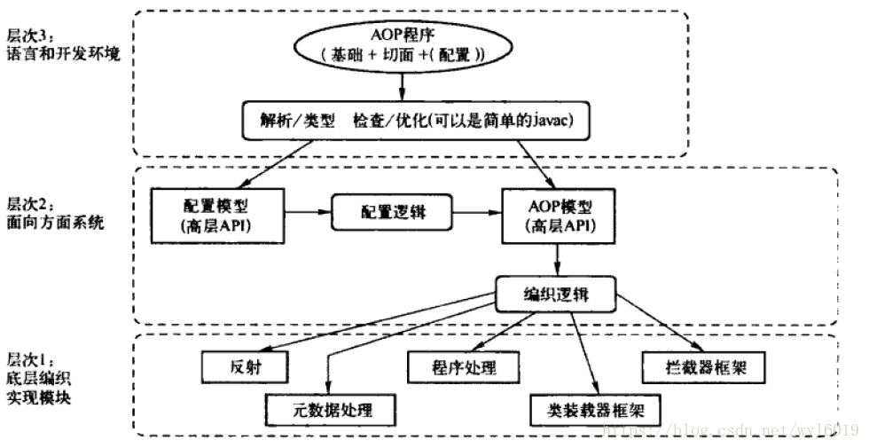
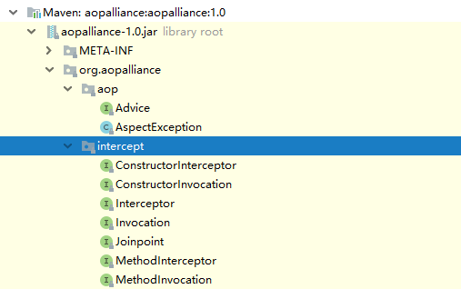
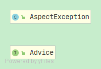
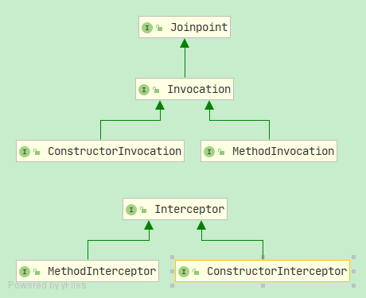
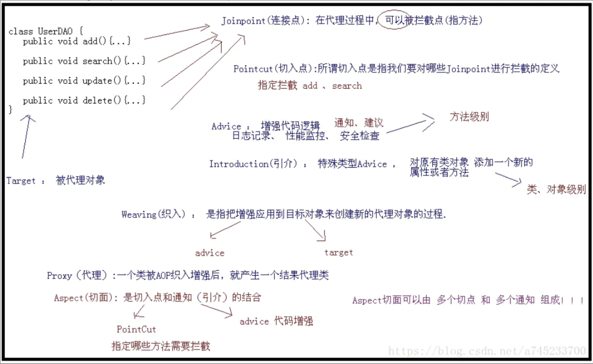

# Spring Aop 的设计哲学

----

**DESCRIPTION:** 前置知识: 理解静态代理和动态代理。

**AUTHOR:** DANTE FUNG

**DANTE:** 2021-3-5 12:21:51

----

## 1、AOP

### what?

AOP（Aspect-OrientedProgramming，面向方面编程），可以说是OOP（Object-Oriented Programing，面向对象编程）的补充和完善。

### why?
OOP引入*封装*、*继承*和*多态性*等概念来建立一种`对象层次结构`，用以模拟公共行为的一个集合。当我们需要为分散的对象引入公共行为的时候，OOP则显得无能为力。也就是说，**OOP**允许你定义`从上到下`的关系，但并不适合定义`从左到右`的关系。例如日志功能。日志代码往往水平地散布在所有对象层次中，而与它所散布到的对象的核心功能毫无关系。对于其他类型的代码，如安全性、异常处理和透明的持续性也是如此。这种散布在各处的无关的代码被称为横切（cross-cutting）代码，在OOP设计中，它导致了大量代码的重复，而不利于各个模块的重用。

### how?

实现AOP的技术，主要分为两大类：

一是采用动态代理技术，利用截取消息的方式，对该消息进行装饰，以取代原有对象行为的执行；

二是采用静态织入的方式，引入特定的语法创建“切面”，从而使得编译器可以在编译期间织入有关“切面”的代码。

### when?

AOP把软件系统分为两个部分：核心关注点和横切关注点。业务处理的主要流程是核心关注点，与之关系不大的部分是横切关注点。横切关注点的一个特点是，他们经常发生在核心关注点的多处，而各处都基本相似。比如权限认证、日志、事务处理。Aop 的作用在于分离系统中的各种关注点，将核心关注点和横切关注点分离开来。正如Avanade公司的高级方案构架师Adam Magee所说，AOP的核心思想就是“将应用程序中的商业逻辑同对其提供支持的通用服务进行分离。”

### 场景

- Authentication 权限

- Caching 缓存

- Context passing 内容传递

- Error handling 错误处理

- Lazy loading　懒加载

- Debugging　　调试

- logging, tracing, profiling and monitoring　记录跟踪　优化　校准

- Performance optimization　性能优化

- Persistence　　持久化

- Resource pooling　资源池

- Synchronization　同步

- Transactions 事务

### AOP联盟标准

AOP联盟将AOP体系分为三层，从三层结构可以看出，AOP实现方式有很多种，包括反射、元数据处理、程序处理、拦截器处理等。

### AOP联盟API包

 Aop Alliance项目是许多对Aop和java有浓厚兴趣的软件开发人员联合成立的开源项目，其提供的源码都是完全免费的(Public Domain).[官方网站](http://aopalliance.sourceforge.net/)。

 
 
 
 
 
 

| 类名 | 描述 |
| ------ | ------ |
| Advice | 定义通知逻辑的通用处理接口，具体实现可以是任意方式。例如:拦截器框架 |
| Interceptor | interceptor通用形式，使用interceptor定义的通用interceptor可以用来拦截程序中出现的运行时事件。 上述运行时事件可以使用joinpoint实体物化(具体化)。 运行时joinpoint可以是方法调用、字段访问(读/写)、抛出异常。 此接口不直接使用，可以使用表示拦截具体事件的子接口。 |
| Joinpoint| 指方法，在Spring AOP中，一个连接点 总是 代表一个方法的执行。 程序执行过程中一个运行时joinpoint,在这些点关联的静态位置通常会安装有一些Interceptor; 当程序运行到这个运行时Joinpoint时，AOP框架会拦截运行时Jointpoint的执行， 把运行时Joinpoint交给已安装的interceptor们进行处理。|
 Advice定义了AOP框架在某个Joinpoint的通用处理逻辑,而interceptor只是Advice处理逻辑中的一种类型或方式,表示的仅仅是采用拦截处理机制实现了Advice这种功能(参见AOP联盟标准)。
 

 

## 2、术语

### 切面(Aspect)

是切入点和通知(引介)的结合。被抽取的公共模块，可能会横切多个对象。 在Spring AOP中，切面可以使用通用类（基于模式的风格） 或者在普通类中以 @AspectJ 注解来实现。

### 连接点（Join point）

指方法，在Spring AOP中，一个连接点 总是 代表一个方法的执行。

### 通知（Advice）

在切面的某个特定的连接点（Join point）上执行的动作。通知有各种类型，其中包括“around”、“before”和“after”等通知。许多AOP框架，包括Spring，都是以拦截器做通知模型， 并维护一个以连接点为中心的拦截器链。

通知，是指拦截到JoinPoint(连接点)后所要作的事情就是通知。

通知类型分为：前置通知，后置通知，异常通知，最终通知，环绕通知。

注意：在切入点方法正常执行之后，后置通知和异常通知永远只能执行一个。

### 切入点（Pointcut）

切入点是指 我们要对哪些Join point进行拦截的定义。通过切入点表达式，指定拦截的方法，比如指定拦截add、search。

### 引入（Introduction）

（也被称为内部类型声明（inter-type declaration））。引介是一种特殊的通知。在不修改类代码的前提下，Introduction可以在运行期为类动态地添加一些方法或Field。声明额外的方法或者某个类型的字段。Spring允许引入新的接口（以及一个对应的实现）到任何被代理的对象。例如，你可以使用一个引入来使bean实现 IsModified 接口，以便简化缓存机制。

### 目标对象（Target Object）

被一个或者多个切面（aspect）所通知（advise）的对象。也有人把它叫做 被通知（adviced） 对象。 既然Spring AOP是通过运行时代理实现的，这个对象永远是一个 被代理（proxied） 对象。

### 织入（Weaving）
指把增强应用到目标对象来创建新的代理对象的过程。Spring是在运行时完成织入。

### Proxy(代理对象)：

一个类(目标对象)被AOP织入增强后产生的对象，即为代理对象。

----

切入点（pointcut）和连接点（join point）匹配的概念是AOP的关键，这使得AOP不同于其它仅仅提供拦截功能的旧技术。 切入点使得定位通知（advice）可独立于OO层次。 例如，一个提供声明式事务管理的around通知可以被应用到一组横跨多个对象中的方法上（例如服务层的所有业务操作）。

