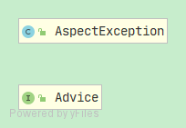
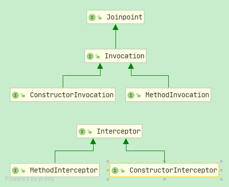
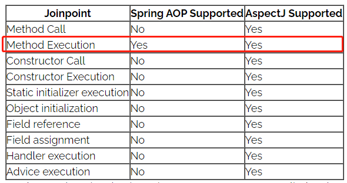
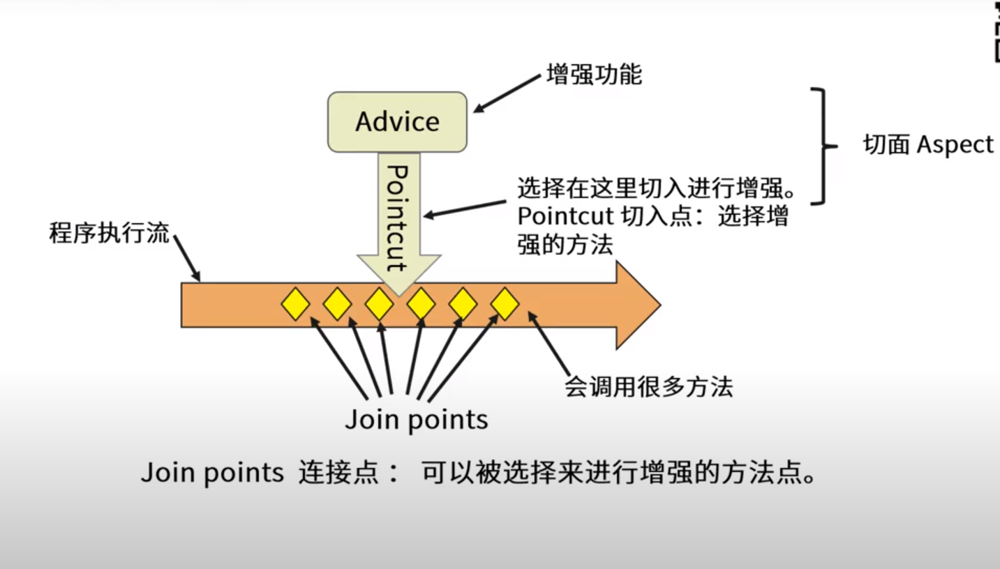
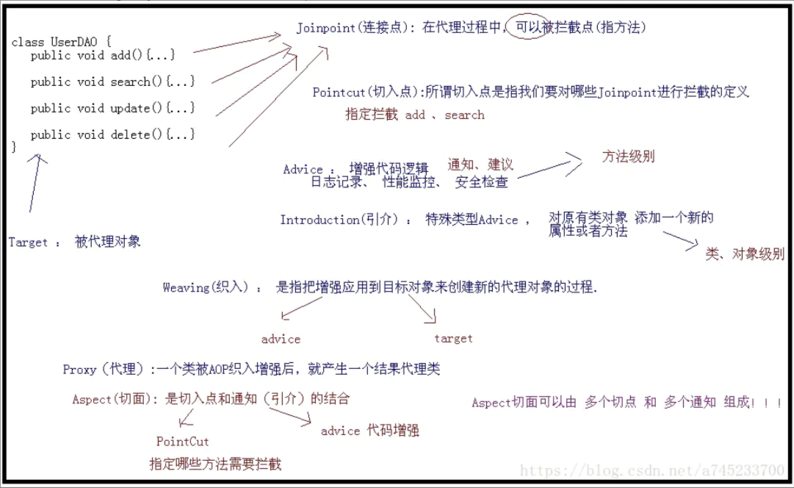
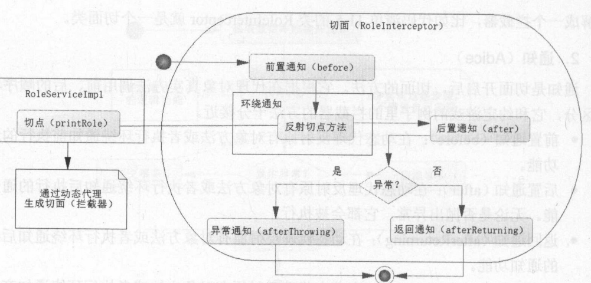

# Spring Aop 的设计哲学

----

**DESCRIPTION:** 前置知识: 理解静态代理和动态代理(jdk、cglib)。

**AUTHOR:** DANTE FUNG

**DANTE:** 2021-3-5 12:21:51

----

## 1、AOP

### what?

AOP（Aspect-OrientedProgramming，面向方面编程），可以说是OOP（Object-Oriented Programing，面向对象编程）的补充和完善。

### why?
OOP引入*封装*、*继承*和*多态性*等概念来建立一种`对象层次结构`，用以模拟公共行为的一个集合。当我们需要为分散的对象引入公共行为的时候，OOP则显得无能为力。也就是说，**OOP**允许你定义`从上到下`的关系，但并不适合定义`从左到右`的关系。例如日志功能。日志代码往往水平地散布在所有对象层次中，而与它所散布到的对象的核心功能毫无关系。对于其他类型的代码，如安全性、异常处理和透明的持续性也是如此。这种散布在各处的无关的代码被称为横切（cross-cutting）代码，在OOP设计中，它导致了大量代码的重复，而不利于各个模块的重用。

### how?

实现AOP的技术，主要分为两大类：

一是采用动态代理技术，利用截取消息的方式，对该消息进行装饰，以取代原有对象行为的执行；

二是采用静态织入的方式，引入特定的语法创建“切面”，从而使得编译器可以在编译期间织入有关“切面”的代码。

### when?

AOP把软件系统分为两个部分：核心关注点和横切关注点。业务处理的主要流程是核心关注点，与之关系不大的部分是横切关注点。横切关注点的一个特点是，他们经常发生在核心关注点的多处，而各处都基本相似。比如权限认证、日志、事务处理。Aop 的作用在于分离系统中的各种关注点，将核心关注点和横切关注点分离开来。正如Avanade公司的高级方案构架师Adam Magee所说，AOP的核心思想就是“将应用程序中的商业逻辑同对其提供支持的通用服务进行分离。”

### 场景

- Authentication 权限

- Caching 缓存

- Context passing 内容传递

- Error handling 错误处理

- Lazy loading　懒加载

- Debugging　　调试

- logging, tracing, profiling and monitoring　记录跟踪　优化　校准

- Performance optimization　性能优化

- Persistence　　持久化

- Resource pooling　资源池

- Synchronization　同步

- Transactions 事务

### AOP联盟标准


AOP联盟将AOP体系分为三层，从三层结构可以看出，AOP实现方式有很多种，包括反射、元数据处理、程序处理、拦截器处理等。


### AOP联盟API包

 Aop Alliance项目是许多对Aop和java有浓厚兴趣的软件开发人员联合成立的开源项目，其提供的源码都是完全免费的(Public Domain).[官方网站](http://aopalliance.sourceforge.net/)。

 

 

 


| 类名 | 描述 |
| ------ | ------ |
| Advice | 定义通知逻辑的通用处理接口，具体实现可以是任意方式。例如:拦截器框架 |
| Interceptor | interceptor通用形式，使用interceptor定义的通用interceptor可以用来拦截程序中出现的运行时事件。<br>上述运行时事件可以使用joinpoint实体物化(具体化)。<br>运行时joinpoint可以是方法调用、字段访问(读/写)、抛出异常。<br>此接口不直接使用，可以使用表示拦截具体事件的子接口。 |
| Joinpoint| 指方法，在Spring AOP中，一个连接点 总是 代表一个方法的执行。<br>程序执行过程中一个运行时joinpoint,在这些点关联的静态位置通常会安装有一些Interceptor;<br>当程序运行到这个运行时Joinpoint时，AOP框架会拦截运行时Jointpoint的执行，<br>把运行时Joinpoint交给已安装的interceptor们进行处理。|
 Advice定义了AOP框架在某个Joinpoint的通用处理逻辑,而interceptor只是Advice处理逻辑中的一种类型或方式,表示的仅仅是采用拦截处理机制实现了Advice这种功能(参见AOP联盟标准)。

 ### 技术选型

 #### AspectJ
 [AspectJ官方地址](https://www.eclipse.org/aspectj/)
 AspectJ实际上是对AOP编程思想的一个实践，当然，除了AspectJ以外，还有很多其它的AOP实现，例如ASMDex，但目前最好、最方便的，依然是AspectJ。

 #### why?

 在AspectJ之前，我们已知:
 - 静态代理
 - jdk动态代理
 - cglib动态代理

 `静态代理`： 重用性差，一个代理不能同时代理多种类。实现方式有两种: *继承* 和 *接口*。

 接口方式示例:
 ``` 
public class TankTimeProxy implements Movable {

    Movable m;

    public TankTimeProxy(Movable m) {
        this.m = m;
    }

    @Override
    public void move() {
        System.out.println("Time Proxy start...........");
        long start = System.currentTimeMillis();
        m.move();
        long end = System.currentTimeMillis();
        System.out.println("花费时间："+(end - start));
        System.out.println("Time Proxy end...........");
    }

} 
 ```

继承方式示例:

``` 
public class Tank2Time extends Tank {

    public void move(){
        System.out.println("Tank2 time  start...........");
        long start = System.currentTimeMillis();
        super.move();
        long end = System.currentTimeMillis();
        System.out.println("花费时间："+(end - start));
        System.out.println("Tank2 time end...........");
    }
}
```

 `jdk动态代理`：动态代理可以做到代理的重用，但是即使这样，他们调用起来还是比较麻烦，除了写切面代码以外，我们还需要将*代理类耦合进被代理类的调用阶段*，在创建被代理类的时候都要先创建代理类，再用代理类去创建被代理类，这就稍微有点麻烦了。
 比如我们想在现有的某个项目里统一新加入一些切面，这时候就需要创建切面并且侵入原有代码，在创建对象的时候添加代理，还是挺麻烦的。

``` 
 public static void main(String[] args)
    {
        //代理的真实对象
        Subject realSubject = new RealSubject();
        
        /**
         * InvocationHandlerImpl 实现了 InvocationHandler 接口，并能实现方法调用从代理类到委托类的分派转发
         * 其内部通常包含指向委托类实例的引用，用于真正执行分派转发过来的方法调用.
         * 即：要代理哪个真实对象，就将该对象传进去，最后是通过该真实对象来调用其方法
         */
        InvocationHandler handler = new InvocationHandlerImpl(realSubject);
 
        ClassLoader loader = realSubject.getClass().getClassLoader();
        Class[] interfaces = realSubject.getClass().getInterfaces();
        /**
         * 该方法用于为指定类装载器、一组接口及调用处理器生成动态代理类实例
         */
        Subject subject = (Subject) Proxy.newProxyInstance(loader, interfaces, handler);
 
        System.out.println("动态代理对象的类型："+subject.getClass().getName());
 
        String hello = subject.SayHello("helloword!");
        System.out.println(hello);
    }
 

```


`cglib代理`：CGLIB(Code Generation Library)是一个开源项目！是一个强大的，高性能，高质量的Code生成类库，
          它可以在运行期扩展Java类与实现Java接口。Hibernate用它来实现PO(Persistent Object 持久化对象)字节码的动态生成。
          CGLIB是一个强大的高性能的代码生成包。它广泛的被许多AOP的框架使用，例如Spring AOP为他们提供
          方法的interception（拦截）。CGLIB包的底层是通过使用一个小而快的字节码处理框架ASM，来转换字节码并生成新的类。
          除了CGLIB包，脚本语言例如Groovy和BeanShell，也是使用ASM来生成java的字节码。当然不鼓励直接使用ASM，
          因为它要求你必须对JVM内部结构包括class文件的格式和指令集都很熟悉。
          
``` 
class Father {
	public void sayHello() {
		System.out.println("this is father");
	}
}

interface Person {
	void speak();

	void walk();
}

class Student extends Father implements Person {
	public void study() {
		System.out.println("i am student.");
	}

	@Override
	public void speak() {
		System.out.println("i am student ,i can speak");
	}

	@Override
	public void walk() {
		System.out.println("i am student ,i can walk");
	}
}

class MyMethodInterceptor implements MethodInterceptor {
	@Override
	public Object intercept(Object obj, Method method, Object[] arg, MethodProxy proxy) throws Throwable {
		System.out.println("Before: " + method);
		Object object = proxy.invokeSuper(obj, arg);
		System.out.println("After: " + method);
		return object;
	}

}

public class MyCglibProxy {

	public static void main(String[] args) {
		//可以指定 CGLIB 将动态生成的代理类保存至指定的磁盘路径下
		System.setProperty(DebuggingClassWriter.DEBUG_LOCATION_PROPERTY, System.getProperty("user.dir") + "/solon-kernel-codebase/target");
		System.out.println(System.getProperty("user.dir"));
		Enhancer enhancer = new Enhancer();
		enhancer.setSuperclass(Student.class);
		enhancer.setCallback(new MyMethodInterceptor());
		Student student = (Student) enhancer.create();
		student.sayHello();
		student.speak();
		student.walk();
		student.study();
	}

}

/**
 * 就是只能为接口中的方法完成代理，而委托类自己的方法或者父类中的方法都不可能被代理。
 * CGLIB 应运而生，它是一个高性能的，底层基于 ASM 框架的一个代码生成框架，它完美的解决了 JDK 版本的
 * 动态代理只能为接口方法代理的单一性不足问题
 *
 * Student 是我们需要代理的委托类型，结果生成的代理类就直接继承了委托类。
 * 这一个小设计就完美的解决了 JDK 动态代理那个单一代理的缺陷，继承了委托类，就可以反射出委托类接口中的所有方法，
 * 父类中的所有方法，自身定义的所有方法，完成这些方法的代理就完成了对委托类所有方法的代理。
 *
 * 说明：cglib生成代理是通过字节码生成的子类作为代理类，因此不能对private final方法代理；
 *
 * 比较：
 * CGLib动态代理创建代理实例速度慢，但是运行速度快；JDK动态代理创建实例速度快，但是运行速度慢。如果实例是单例的，
 * 推荐使用CGLib方式动态代理，反之则使用JDK方式进行动态代理。Spring的实例默认是单例，所以这时候使用CGLib性能高。
 *
 */
```


综上，`静态代理`和`jdk动态代理`并没有做到切面与业务代码的解耦。虽然将切面的逻辑独立进了代理类，但是<font color = "red">决定是否使用切面的权利</font>仍然取决于业务代码。

另外，如果有Spring的ioc容器根据注册信息在创建bean的时候自动加上代理就另说了。

----

#### What?

AspectJ提供了两套机制：

- 切面语法
- 织入工具

`切面语法`：这套东西做到了将 决定是否使用切面的权利还给了切面。在写切面的时候就可以决定哪些类的哪些方法会被代理，从而从逻辑上不需要侵入业务代码。

 1.  基于java注解切面描述的方法，这种方法兼容java语法，写起来十分方便，不需要IDE的额外语法检测支持。
 2. 基于aspect文件的切面描述方法，这种语法本身并不是java语法，因此写的时候需要IDE的插件支持才能进行语法检查。

`织入工具`：切面语法能够让切面 从*逻辑上*与业务代码解耦，但是 从*操作上*来讲，当JVM运行业务代码的时候，他甚至无从得知旁边还有个类想横插一刀。
针对这个问题，有两种思路：

 1. 提供注册机制，通过额外的配置文件指明哪些类受到切面的影响，不过这还是需要干涉对象创建的过程。
 2. 在编译期(或者类加载期)我们优先考虑一下切面代码，并将切面代码通过某种形式插入到业务代码中，这样业务代码不就知道自己被“切”了么？这种思路的一个实现就是 aspectjweaver，就是这里的 织入工具。

##### AspectJ相关jar包

| jar包名    | 描述 |
| ----------------- | ------------------------------------------------------------ |
| aspectjrt.jar     | 提供 **运行时**的一些注解，静态方法等等东西，通常我们要使用aspectJ的时候都要使用这个包。 |
| aspectjtools.jar  | 主要是提供赫赫有名的 **ajc编译器**，可以在编译期将将java文件或者class文件或者aspect文件定义的切面织入到业务代码中。通常这个东西会被封装进各种IDE插件或者自动化插件中。 |
| aspectjweaver.jar | 主要是提供了一个java agent用于在 **类加载期**间织入切面(Load time weaving)。并且提供了对切面语法的相关处理等基础方法，供ajc使用或者供第三方开发使用。这个包一般我们不需要显式引用，除非需要使用LTW(加载时织入)。 |

上面的说明其实也就指出了aspectJ的几种标准的使用方法：

1. **编译时织入**
   利用ajc编译器替代javac编译器，直接将源文件(java或者aspect文件)编译成class文件并将切面织入进代码。
2. **编译后织入**
   利用ajc编译器向javac编译期编译后的class文件或jar文件织入切面代码。
3. **加载时织入**
   不使用ajc编译器，利用aspectjweaver.jar工具，使用java agent代理在类加载期将切面织入进代码。 AspectJ LTW 是基于 JDK 动态代理技术实现的，所以它的作用范围是整个 JVM ，因此这种方式较为粗放，对于单一 JVM 多个应用的场景并不适用 。

#### How?
参见文档:

- [关于AspectJ你可能不知道的那些事](https://blog.csdn.net/d_o_n_g2/article/details/85046536?utm_medium=distribute.pc_relevant.none-task-blog-BlogCommendFromMachineLearnPai2-2.control&dist_request_id=1328602.14416.16149500828197117&depth_1-utm_source=distribute.pc_relevant.none-task-blog-BlogCommendFromMachineLearnPai2-2.control)

- [Intro to AspectJ](https://www.baeldung.com/aspectj)

#### 小结

1、介绍了AOP的 诞生的渊源、诞生该思想的契机。

2、介绍了为了标准化AOP，有专门的AOP联盟提供一套标准的API。

3、AOP联盟标准底层编织技术选择：JDK动态代理、CGLIB代理、AspectJ


----

## Spring AOP 与 AspectJ的关系


我们现在主流的做法是将spring aop和aspectj结合使用，spring借鉴了AspectJ的切面，以提供注解驱动的AOP。


|                | 目标及功能                                                   |
| -------------- | ------------------------------------------------------------ |
| **AspectJ**    | **AspectJ is the original AOP technology which aims to provide complete AOP solution.** |
| **Spring AOP** | **It is not intended as a complete AOP solution** – it can only be applied to beans that are managed by a Spring container. |

AspectJ旨在提供一套完整的AOP解决方案。

Spring AOP 并不是完整的AOP解决方案。它旨在通过IOC容器提供一个简单的AOP实现，用于解决大部分程序员所面临常见的问题。

// TODO: 这里可以展开讲讲程序员所常见的问题，为何可以使用IOC提供一个简单的AOP实现。

----



为何只提供*方法的切面*？由于Spring是基于代理模式，在运行时织入切面逻辑，Java的语言特性的限制：

> But it comes with a limitation. **We cannot apply cross-cutting concerns (or aspects) across classes that are “final” because they cannot be overridden and thus it would result in a runtime exception.**
>
> The same applies for static and final methods. Spring aspects cannot be applied to them because they cannot be overridden. Hence Spring AOP because of these limitations, only supports method execution join points.

值得注意的一点:  `自调用问题`。

> It's also worth noting that in Spring AOP, aspects aren't applied to the method called within the same class.
>
> 同样值得注意的是，在Spring AOP中，方面并不应用于同一个类中调用的方法。
>
> That's obviously because when we call a method within the same class, then we aren't calling the method of the proxy that Spring AOP supplies. If we need this functionality, then we do have to define a separate method in different beans, or use AspectJ.
>
> 这显然是因为当我们调用同一个类中的方法时，我们并没有调用Spring AOP提供的代理的方法。如果我们需要这个功能，那么我们必须在不同的bean中定义一个单独的方法，或者使用AspectJ。

网上有很多分析`自调用`的文章，不过你真正理解Spring AOP的代理机制就不会犯这种糊涂了。


> This quick table summarizes the key differences between Spring AOP and AspectJ:

| **Spring AOP**                                               | **AspectJ**                                                  |
| ------------------------------------------------------------ | ------------------------------------------------------------ |
| Implemented in pure Java                                     | Implemented using extensions of Java programming language    |
| No need for separate compilation process                     | Needs AspectJ compiler (ajc) unless LTW is set up            |
| Only runtime weaving is available                            | Runtime weaving is not available. Supports compile-time, post-compile, and load-time Weaving |
| Less Powerful – only supports method level weaving           | More Powerful – can weave fields, methods, constructors, static initializers, final class/methods, etc… |
| Can only be implemented on beans managed by Spring container | Can be implemented on all domain objects                     |
| Supports only method execution pointcuts                     | Support all pointcuts                                        |
| Proxies are created of targeted objects, and aspects are applied on these proxies | Aspects are weaved directly into code before application is executed (before runtime) |
| Much slower than AspectJ                                     | Better Performance                                           |
| Easy to learn and apply                                      | Comparatively more complicated than Spring AOP               |


## Spring AOP 的代理机制

> Spring Aop makes use of runtime weaving.

[Comparing Spring AOP and AspectJ](https://www.baeldung.com/spring-aop-vs-aspectj)一文中提到Spring的Aop是在运行时织入的。

> With runtime weaving, the aspects are woven during the execution of the application using proxies of the targeted object – using either JDK dynamic proxy or CGLIB proxy (which are discussed in next point):

这里提到Spring Aop是在运行时期通过JDK的动态代理或者CGLIB代理实现对目标对象的代理并将切面逻辑的织入。


> ### **3.3. Internal Structure and Application**
>
> Spring AOP is a proxy-based AOP framework. This means that to implement aspects to the target objects, it'll create proxies of that object. This is achieved using either of two ways:
>
> 1. JDK dynamic proxy – the preferred way for Spring AOP. Whenever the targeted object implements even one interface, then JDK dynamic proxy will be used
> 2. CGLIB proxy – if the target object doesn't implement an interface, then CGLIB proxy can be used


## 2、术语



### 切面(Aspect)

是切入点和通知(引介)的结合。被抽取的公共模块，可能会横切多个对象。 在Spring AOP中，切面可以使用通用类（基于模式的风格） 或者在普通类中以 @AspectJ 注解来实现。

### 连接点（Join point）

指方法，在Spring AOP中，一个连接点 总是 代表一个方法的执行。

A joinpoint is a candidate point in the Program Execution of the application where an aspect can be plugged in. This point could be a method being called, an exception being thrown, or even a field being modified. These are the points where your aspect’s code can be inserted into the normal flow of your application to add new behavior.

### 通知（Advice）

增强的逻辑。

在切面的某个特定的连接点（Join point）上执行的动作。通知有各种类型，其中包括“around”、“before”和“after”等通知。许多AOP框架，包括Spring，都是以拦截器做通知模型， 并维护一个以连接点为中心的拦截器链。

通知，是指拦截到JoinPoint(连接点)后所要作的事情就是通知。

通知类型分为：前置通知，后置通知，异常通知，最终通知，环绕通知。

注意：在切入点方法正常执行之后，后置通知和异常通知永远只能执行一个。

### 切入点（Pointcut）

切入点是指 我们要对哪些Join point进行拦截的定义。通过切入点表达式，指定拦截的方法，比如指定拦截add、search。

### 引入（Introduction）

（也被称为内部类型声明（inter-type declaration））。引介是一种特殊的通知。在不修改类代码的前提下，Introduction可以在运行期为类动态地添加一些方法或Field。声明额外的方法或者某个类型的字段。Spring允许引入新的接口（以及一个对应的实现）到任何被代理的对象。例如，你可以使用一个引入来使bean实现 IsModified 接口，以便简化缓存机制。

### 目标对象（Target Object）

被一个或者多个切面（aspect）所通知（advise）的对象。也有人把它叫做 被通知（adviced） 对象。 既然Spring AOP是通过运行时代理实现的，这个对象永远是一个 被代理（proxied） 对象。

### 织入（Weaving）
指把增强应用到目标对象来创建新的代理对象的过程。Spring是在运行时完成织入。

### Proxy(代理对象)：

一个类(目标对象)被AOP织入增强后产生的对象，即为代理对象。

----

切入点（pointcut）和连接点（join point）匹配的概念是AOP的关键，这使得AOP不同于其它仅仅提供拦截功能的旧技术。 切入点使得定位通知（advice）可独立于OO层次。 例如，一个提供声明式事务管理的around通知可以被应用到一组横跨多个对象中的方法上（例如服务层的所有业务操作）。




### 切面流程


## Reference

- [https://github.com/yihonglei/thinking-in-spring](https://github.com/yihonglei/thinking-in-spring)

- [关于AspectJ你可能不知道的那些事](https://blog.csdn.net/d_o_n_g2/article/details/85046536?utm_medium=distribute.pc_relevant.none-task-blog-BlogCommendFromMachineLearnPai2-2.control&dist_request_id=1328602.14416.16149500828197117&depth_1-utm_source=distribute.pc_relevant.none-task-blog-BlogCommendFromMachineLearnPai2-2.control)

- [Comparing Spring AOP and AspectJ](https://www.baeldung.com/spring-aop-vs-aspectj)

- [Intro to AspectJ](https://www.baeldung.com/aspectj)

- [Spring官方文档](https://docs.spring.io/spring-framework/docs/current/reference/html/core.html#aop-proxying)

  

