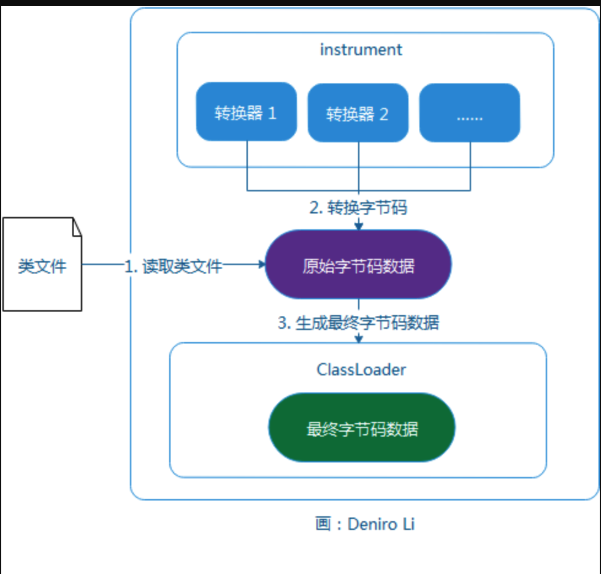
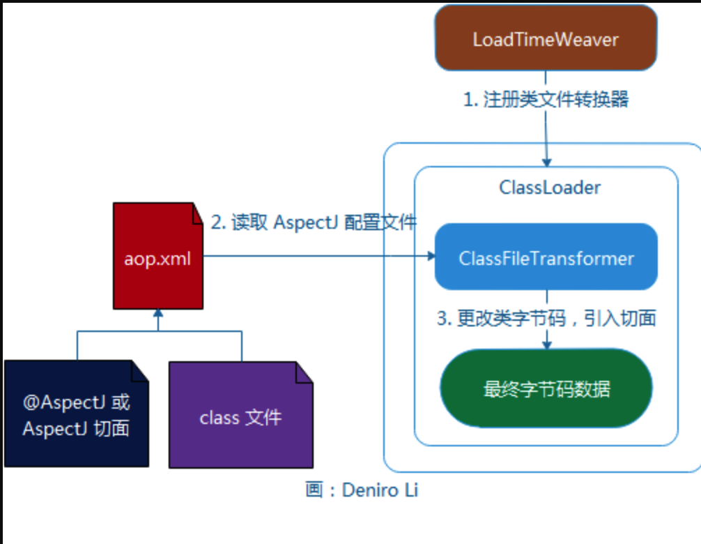

> 本文由 [简悦 SimpRead](http://ksria.com/simpread/) 转码， 原文地址 [blog.csdn.net](https://blog.csdn.net/deniro_li/article/details/82018648)

我们可以在类加载期通过字节码编辑技术将切面织入目标类，这种方式叫做 LTW（Load Time Weaving）。

AspectJ LTW 使用 Java 5.0 提供的代理功能实现织入工作。JDK 的代理功能能够让代理器访问到 JVM 的底层部件，借此向 JVM 注册类文件转换器，在类加载时对类文件的字节码进行转换。 AspectJ LTW 是基于 JDK 动态代理技术实现的，所以它的作用范围是整个 JVM，因此这种方式较为粗放，对于单一 JVM 多个应用的场景并不适用。

相对于 AspectJ LTW， Spring LTW 提供了细粒度的控制，支持在单个 ClassLoader 范围内实施类文件转换，且配置更为简单。

1 instrument 包的工作原理
===================

JDK5.0 新增了 java.lang.instrument 包，它包含能对 JVM 底层组件进行访问的类。 我们可以在启动时通过 JVM 的 java agent 代理参数获取 JVM 内部组件的引用，以便在后续操作中使用。 借助 JDK 动态代理，我们可以在 JVM 启动时装配并应用 ClassTransformer，对类字节码进行转换，从而实现 AOP 功能。

java.lang.instrument 包含两个重要接口。

1.1 ClassFileTransformer
------------------------

它是 Class 文件转换器接口，它定义了一个方法：

```
byte[]
    transform(  ClassLoader         loader,
                String              className,
                Class<?>            classBeingRedefined,
                ProtectionDomain    protectionDomain,
                byte[]              classfileBuffer)
        throws IllegalClassFormatException;
```

该方法实现对 Class 文件的字节码进行转换， classfileBuffer 是类文件对应的字节码数组，返回的 byte[] 为转换后的字节码。 如果返回 null，则表示不进行字节码转换。

1.2 Instrumentation
-------------------

代表 JVM 内部的一个构件 可以通过该接口的方法向 JVM 的 Instrumentation 注册一些 ClassFileTransformer，注册转换器的接口方法为：

```
void
    addTransformer(ClassFileTransformer transformer, boolean canRetransform);
```

当 ClassFileTransformer 实例注册到 JVM 后， JVM 在加载 Class 文件时，会先调用这个 ClassFileTransformer 的 transform() 方法对 Class 文件的字节码进行转换。 如果向 JVM 中注册多个 ClassFileTransformer，它们将按注册的顺序被调用。 这样 ClassFileTransformer 的实现者就可以从 JVM 层面截获所有类的字节码，并加入希望添加的逻辑。

下图描绘了拥有多个转换器的 JVM 从加载类到最终生成对应的类字节码的过程：



2 使用 LTW 织入切面
=============

Spring LTW 支持 AspectJ 定义的切面，既可以是直接采用 AspectJ 语法定义的切面，也可以是采用基于 @AspectJ 注解通过 Java 类定义的切面。Spring LTW 采用了与 AspectJ LTW 相同的基础架构，即利用类路径下的 `META-INF/aop.xml` 配置文件找到切面定义及切面所要实施的候选目标类，通过 LoadTimeWeaver 在 ClassLoader 加载类文件时将切面织入目标类中。



利用特定 Web 容器的 ClassLoader，通过 LoadTimeWeaver 将 Spring 提供的 ClassFileTransformer 注册到容器的 ClassLoader 中。在类加载期间，注册的 ClassFileTransformer 会读取 AspectJ 的配置文件，即类路径下的 META-INF/aop.xml 文件，获取切面，接着对 Bean 类进行字节码转换，织入切面。Spring 容器初始化 Bean 实例时，采用的 Bean 类就是已经被织入切面的类。

2.1 LoadTimeWeaver
------------------

大多数的 Web 应用服务器 (除了 Tomcat) 的 ClassLoader 无需通过 javaagent 参数指定代理，即可支持直接访问 Instrument。拥有这种能力的 ClassLoader 被称之为 “ 组件使能（ instrumentation-capable ） ”。 通过组件使能能力，我们就可以方便地访问 ClassLoader 的 Instrument。 Spring 使用 Web 应用服务器类加载器，为这些应用服务器分别提供了专门的 LoadTimeWeaver, 以便向特定的 ClassLoader 注册 ClassFileTransformer，然后再对指定的类进行字节码转换，实现切面的织入。

Spring 的 `org.springframework.instrument.classloading.LoadTimeWeaver` 接口定义了类加载期织入器的高层协议，该接口包含三个方法。

<table><thead><tr><th>方法</th><th>说明</th></tr></thead><tbody><tr><td><code>void addTransformer(ClassFileTransformer transformer)</code></td><td>新增 transformer 到织入器<h-char unicode="3002" class="biaodian cjk bd-end bd-cop bd-hangable"><h-inner>。</h-inner></h-char></td></tr><tr><td><code>ClassLoader getInstrumentableClassLoader()</code></td><td>返回具有 Instrument 功能的 ClassLoader<h-char unicode="3002" class="biaodian cjk bd-end bd-cop bd-hangable"><h-inner>。</h-inner></h-char></td></tr><tr><td><code>ClassLoader getThrowawayClassLoader()</code></td><td>返回可丢弃的 ClassLoader<h-char unicode="3002" class="biaodian cjk bd-end bd-cop bd-hangable"><h-inner>。</h-inner></h-char></td></tr></tbody></table>

2.2 配置 Spring
-------------

```
<?xml version="1.0" encoding="UTF-8"?>
<beans xmlns="http://www.springframework.org/schema/beans"
       xmlns:xsi="http://www.w3.org/2001/XMLSchema-instance"
       xmlns:context="http://www.springframework.org/schema/context"
       xsi:schemaLocation="http://www.springframework.org/schema/beans http://www.springframework.org/schema/beans/spring-beans-4.0.xsd   http://www.springframework.org/schema/context http://www.springframework.org/schema/context/spring-context.xsd">

    <!-- 启用装载期织入-->
    <context:load-time-weaver/>
</beans>
```

2.3 配置 Tomcat
-------------

_这里以 Tomcat6.x 和 Tomcat7.x 为例。_

1.  首先在该[页面](http://maven.springframework.org/release/org/springframework/spring-instrument-tomcat/)中下载对应 Spring 框架版本的 spring-instrument-tomcat-{version}.jar，然后复制到 `<TOMCAT_HOME>/lib` 下，该 JAR 只有两个类，其中一个即是 TomcatInstrumentableClassLoader 类。
2.  接着在 META-INF 目录下，新建 context.xml，内容为：

```
<?xml version="1.0" encoding="UTF-8"?>
<Context path="/xxx" docBase="xxx">
    <loader
            loaderClass="org.springframework.instrument.classloading.tomcat.TomcatInstrumentableClassLoader"
            useSystemClassLoaderAsParent="false"/>
</Context>
```

通过以上配置，Tomcat 容器就支持直接在类加载期实现织入功能啦 O(∩_∩)O~

2.4 具有组件使能的 Web 应用服务器
---------------------

具有组件使能的 Web 应用服务器有以下这几种：

*   BEA WebLogic 10.0+
*   OC4J 10.1.3.1+
*   Resin 3.1+
*   JBoss 5.x+

如果应用是运行在这些 Web 应用服务器中，那么我们就只需在 Spring 中配置 `<context:load-time-weaver/>` 就可以啦 O(∩_∩)O~