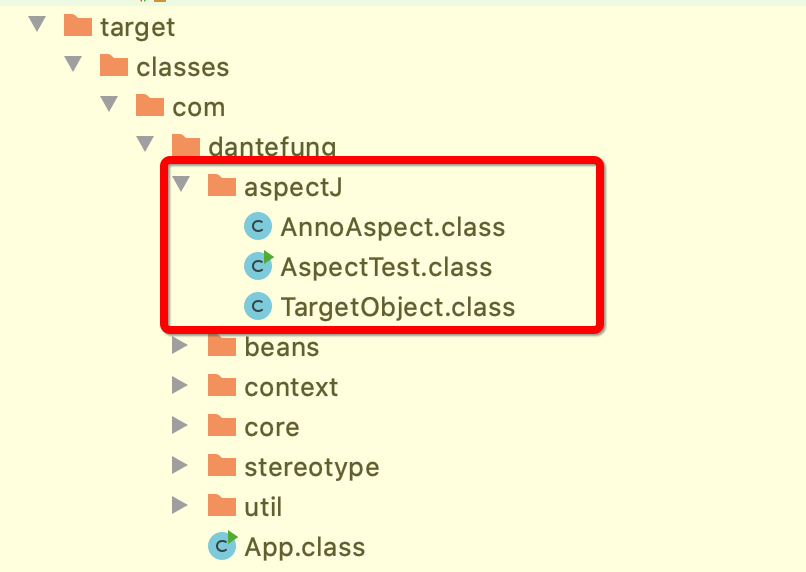
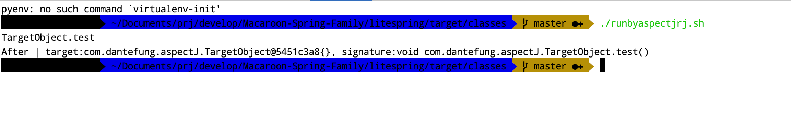

## 赋予脚本执行权限
``` 
chmod +x incompileweaver.sh
chmod +x runbyaspectjrj.sh
chmod +x aftercompileweaver.sh
chmod +x firstcompile.sh
```
# 编译时织入

## incompileweaver.sh
Macaroon-Spring-Family/litespring/src/test/java/com/dantefung/aspectJ目录下，执行如下命令：
``` 
./incompileweaver.sh
```
效果:

``` 
//
// Source code recreated from a .class file by IntelliJ IDEA
// (powered by Fernflower decompiler)
//

package com.dantefung.aspectJ;

import org.aspectj.lang.JoinPoint;
import org.aspectj.lang.NoAspectBoundException;
import org.aspectj.lang.annotation.After;
import org.aspectj.lang.annotation.Aspect;

@Aspect
public class AnnoAspect {
    public AnnoAspect() {
    }

    @After("execution(* com.dantefung.aspectJ.TargetObject.*(..))")
    public void afterDo(JoinPoint joinPoint) {
        System.out.println("After | target:" + joinPoint.getTarget() + "{}, signature:" + joinPoint.getSignature());
    }

    public static AnnoAspect aspectOf() {
        if (ajc$perSingletonInstance == null) {
            throw new NoAspectBoundException("com.dantefung.aspectJ.AnnoAspect", ajc$initFailureCause);
        } else {
            return ajc$perSingletonInstance;
        }
    }

    public static boolean hasAspect() {
        return ajc$perSingletonInstance != null;
    }

    static {
        try {
            ajc$postClinit();
        } catch (Throwable var1) {
            ajc$initFailureCause = var1;
        }

    }
}

```

``` 
//
// Source code recreated from a .class file by IntelliJ IDEA
// (powered by Fernflower decompiler)
//

package com.dantefung.aspectJ;

import org.aspectj.lang.JoinPoint;
import org.aspectj.runtime.reflect.Factory;

public class TargetObject {
    public TargetObject() {
    }

    public void test() {
        JoinPoint var1 = Factory.makeJP(ajc$tjp_0, this, this);

        try {
            System.out.println("TargetObject.test");
        } catch (Throwable var3) {
            AnnoAspect.aspectOf().afterDo(var1);
            throw var3;
        }

        AnnoAspect.aspectOf().afterDo(var1);
    }

    static {
        ajc$preClinit();
    }
}

```


## runbyaspectjrj.sh
Macaroon-Spring-Family/litespring/target/classes目录下放入runbyaspectjrj.sh，并执行如下命令:
``` 
./runbyaspectjrj.sh 
```
效果:


# 编译后织入
Macaroon-Spring-Family/litespring/src/test/java/com/dantefung/aspectJ目录下，执行如下命令：
``` 
./firstcompile.sh
```

``` 
//
// Source code recreated from a .class file by IntelliJ IDEA
// (powered by Fernflower decompiler)
//

package com.dantefung.aspectJ;

import org.aspectj.lang.JoinPoint;
import org.aspectj.lang.annotation.After;
import org.aspectj.lang.annotation.Aspect;

@Aspect
public class AnnoAspect {
    public AnnoAspect() {
    }

    @After("execution(* com.dantefung.aspectJ.TargetObject.*(..))")
    public void afterDo(JoinPoint var1) {
        System.out.println("After | target:" + var1.getTarget() + "{}, signature:" + var1.getSignature());
    }
}

```

``` 
//
// Source code recreated from a .class file by IntelliJ IDEA
// (powered by Fernflower decompiler)
//

package com.dantefung.aspectJ;

public class TargetObject {
    public TargetObject() {
    }

    public void test() {
        System.out.println("TargetObject.test");
    }
}

```


``` 
//
// Source code recreated from a .class file by IntelliJ IDEA
// (powered by Fernflower decompiler)
//

package com.dantefung.aspectJ;

public class AspectTest {
    public AspectTest() {
    }

    public static void main(String[] var0) {
        TargetObject var1 = new TargetObject();
        var1.test();
    }
}

```
Macaroon-Spring-Family/litespring/target/classes目录下放入runbyaspectjrj.sh，并执行如下命令:
``` 
./aftercompileweaver.sh 
```

## 使用spectj-maven-plugin
显然，自己写脚本还是比较麻烦的，如果用如maven这样的自动化构建工具的话就会方便很多，codehaus提供了一个ajc的编译插件aspectj-maven-plugin，我们只需要在build/plugins标签下加上这个插件的配置即可
这个插件会绑定到编译期，采用的应该是编译后织入的方式，在maven-compiler-plugin处理完之后再工作的。
不要以为这个插件多厉害，说白了他其实就是对aspectjtools.jar的一个mojo 封装而已
``` 
<build>
    <plugins>
        <plugin>
            <groupId>org.codehaus.mojo</groupId>
            <artifactId>aspectj-maven-plugin</artifactId>
            <executions>
                <execution>
                    <goals>
                        <goal>compile</goal>
                        <goal>test-compile</goal>
                    </goals>

                    <configuration>
                        <source>1.5</source>
                        <target>1.5</target>
                    </configuration>
                </execution>
            </executions>
        </plugin>
    </plugins>
</build>
```
