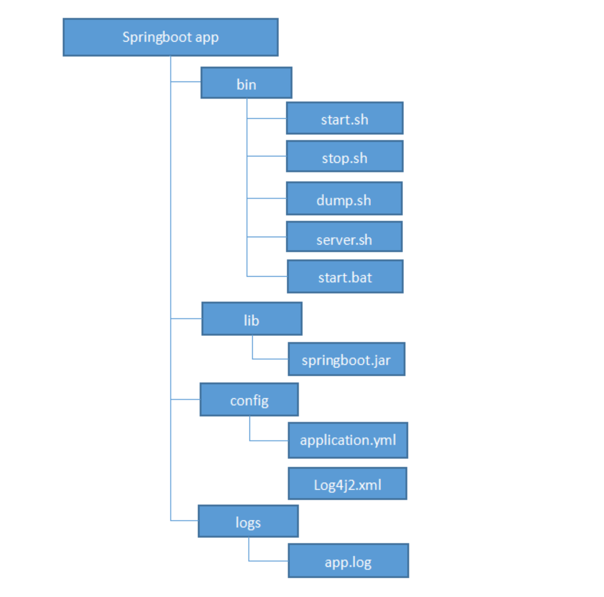

# 工程简介
目前springboot项目的几种常见的部署方式:

1、使用docker容器去部署，将springboot的应用构建成一个docker image，然后通过容器去启动镜像 ，这种方式在需要部署大规模的应用和应用扩展时是非常方便的，属于目前工业级的部署方案，但是需要掌握docker的生态圈技术。
 
2、使用fatjar直接部署启动，这是很多初学者或者极小规模情况下的一个简单应用部署方式。

## 为什么要springboot服务化打包?
最近我看到一个项目团队，他们在采用springboot开发完项目构建交互给运维团队就是一个spring boot 的fatjar。而且这种原始打出的包在传统型项目开发公司，对于运维人员来说无疑是很致命的，项目交付后整个配置文件都被隐藏到打成的jar中，针对不同的环境修改配置文件就变成了一件很困难的事情。因此，我们在公司引入任何新技术时，一定要考虑怎么去做服务化和工程化，如果仅仅引用技术框架，很多时候可能只需要加入几个依赖，看下api写几行代码就能跑起来。

针对上面的这种问题，要去做服务化和工程化，大致要解决两点问题：

让springboot能够加载jar外的配置文件。
提供一个服务化的启动脚本，这个脚本一般是shell或者windows下的bat ，有了springboot的应用服务脚本后，就可以很容易的去启动和停止springboot的应用了。

## 打包后的springboot应用结构图


## 打包后应用的日志路径处理

打包的应用日志一般统一输出到logs目录中，但是对于不同的系统平台，虽然配置的日志输出路径是一样的，但是最后不一定输出到logs中。经过测试在windows平台中使用相对的日志路径../logs是没有问题的，但是对于linux系统下使用相对路径就不能输出到logs下，因此建议在linux平台下就写绝对路径吧。不过在我提供的脚本中设置输出日志的路径

```
-Dlogging.path=../logs
```

因此结合log4j2的强大解析能力完全可以设置log42的日志路径（开发时则手动指定路径）:

```
<property name="LOG_HOME">${sys:logging.path}</property>
```
## 脚本用例

```
# 启动应用

./start.sh

# 以debug方式启动
./start debug

# 启动任务并开启jmx监控

./start jmx
# 获取当前的运行状态
./start status

```

# 延伸阅读

