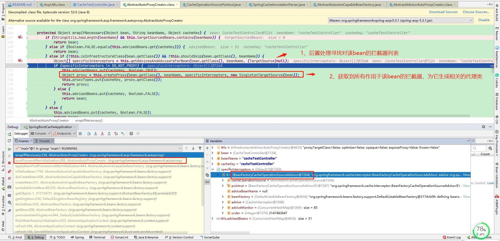

# Getting Started

## Cache & CacheManager

**Cache**的实现类: `AbstractValueAdaptingCache`、`RedisCache extends AbstractValueAdaptingCache`...

**CacheManager**的实现类: `CaffeineCacheManager`、`EhCacheCacheManager`、`JCacheCacheManager` 、`RedisCacheManager`...
AbstractTransactionSupportingCacheManager
```
public abstract class AbstractCacheManager implements CacheManager, InitializingBean {

    // 分成多个缓存容器  
	private final ConcurrentMap<String, Cache> cacheMap = new ConcurrentHashMap<>(16);

	private volatile Set<String> cacheNames = Collections.emptySet();


	// Early cache initialization on startup

	@Override
	public void afterPropertiesSet() {
		initializeCaches();
	}

	/**
	 * Initialize the static configuration of caches.
	 * <p>Triggered on startup through {@link #afterPropertiesSet()};
	 * can also be called to re-initialize at runtime.
	 * @since 4.2.2
	 * @see #loadCaches()
	 */
	public void initializeCaches() {
		Collection<? extends Cache> caches = loadCaches();

		synchronized (this.cacheMap) {
			this.cacheNames = Collections.emptySet();
			this.cacheMap.clear();
			Set<String> cacheNames = new LinkedHashSet<>(caches.size());
			for (Cache cache : caches) {
				String name = cache.getName();
				this.cacheMap.put(name, decorateCache(cache));
				cacheNames.add(name);
			}
			this.cacheNames = Collections.unmodifiableSet(cacheNames);
		}
	}
	 ... ...
}	
```


```
public class EhCacheCacheManager extends AbstractCacheManager {

... ...

	@Override
	protected Collection<Cache> loadCaches() {
		Assert.notNull(this.cacheManager, "A backing EhCache CacheManager is required");
		Status status = this.cacheManager.getStatus();
		Assert.isTrue(Status.STATUS_ALIVE.equals(status),
				"An 'alive' EhCache CacheManager is required - current cache is " + status.toString());

		String[] names = this.cacheManager.getCacheNames();
		Collection<Cache> caches = new LinkedHashSet<Cache>(names.length);
		for (String name : names) {
			caches.add(new EhCacheCache(this.cacheManager.getEhcache(name)));
		}
		return caches;
	}
... ...
}
```

## @Cacheable & @CacheEvict & @CachePut
### 1、SpringCacheAnnotationParser解析注解
> NOTE:
> 那这个SpringCacheAnnotationParser是在什么时候被调用的呢？很简单，我们在这个类的某个方法上打个断点，然后debug就行了，比如parseCacheableAnnotation方法。
>
> AbstractAutowireCapableBeanFactory的BeanFactory，然后这个类在创建Bean的时候会去找是否有Advisor。正好Spring Cache源码里就定义了这么一个Advisor：BeanFactoryCacheOperationSourceAdvisor。
>
> 这个Advisor返回的PointCut是一个CacheOperationSourcePointcut，这个PointCut复写了matches方法，在里面去获取了一个CacheOperationSource，调用它的getCacheOperations方法。这个CacheOperationSource是个接口，主要的实现类是AnnotationCacheOperationSource(按缓存注解匹配 AnnotationCacheOperationSource) extends AbstractFallbackCacheOperationSource。`cas.getCacheOperations(method, targetClass)`中在findCacheOperations方法里，就会调用到我们最开始说的SpringCacheAnnotationParser了，然后解析出是哪种CacheOperation。
>
> 流程: spring解析完Beandefinition后,注册到BeanFactory,然后创建bean的过程中，通过BeanDefinition初始化完bean后，进行遍历后置器，执行后置处理操作(AbstractAutowireCapableBeanFactory.applyBeanPostProcessorsAfterInitialization), 查看是否有必要进行包装处理(生成代理)，判断是否有切面代理(通过检查类的方法上是否有解析出来的CacheOperation。), 然后生成代理类。





|注解|对象|父类|备注|
|---|---|---|---|
|@Cacheable |CacheableOperation|CacheOperation|SpringCacheAnnotationParser解析@Cacheable转化为CacheableOperation|
|@CacheEvict |CacheEvictOperation|CacheOperation|SpringCacheAnnotationParser解析@CacheEvict转化为CacheEvictOperation|
|@CachePut |CachePutOperation|CacheOperation|SpringCacheAnnotationParser解析@CachePut转化为CachePutOperation|

```
operations = {ArrayList@8978}  size = 1
 0 = {CacheableOperation@8983} "Builder[public java.lang.Object com.dantefung.springbootcache.controller.CacheTestController.getUserById(java.lang.String)] caches=[getUserById] | key='#id' | keyGenerator='' | cacheManager='caffeineCacheManager' | cacheResolver='' | condition='' | unless='' | sync='false'"
  unless = ""
  sync = false
  name = "public java.lang.Object com.dantefung.springbootcache.controller.CacheTestController.getUserById(java.lang.String)"
  cacheNames = {LinkedHashSet@8987}  size = 1
  key = "#id"
  keyGenerator = ""
  cacheManager = "caffeineCacheManager"
  cacheResolver = ""
  condition = ""
  toString = "Builder[public java.lang.Object com.dantefung.springbootcache.controller.CacheTestController.getUserById(java.lang.String)] caches=[getUserById] | key='#id' | keyGenerator='' | cacheManager='caffeineCacheManager' | cacheResolver='' | condition='' | unless='' | sync='false'"


```


### CacheInterceptor extends CacheAspectSupport处理.

> Base class for caching aspects, such as the {@link CacheInterceptor} or an
> AspectJ aspect.
>
> <p>This enables the underlying Spring caching infrastructure to be used easily
> to implement an aspect for any aspect system.
>
> <p>Subclasses are responsible for calling relevant methods in the correct order.
>
> <p>Uses the <b>Strategy</b> design pattern. A {@link CacheOperationSource} is
> used for determining caching operations, a {@link KeyGenerator} will build the
> cache keys, and a {@link CacheResolver} will resolve the actual cache(s) to use.
>
> <p>Note: A cache aspect is serializable but does not perform any actual caching
> after deserialization. 

CacheResolver: 

``` 
	@Override
	public void afterSingletonsInstantiated() {
		if (getCacheResolver() == null) {
			// Lazily initialize cache resolver via default cache manager...
			Assert.state(this.beanFactory != null, "CacheResolver or BeanFactory must be set on cache aspect");
			try {
			    // 设置CacheManager构造CacheResolver
				setCacheManager(this.beanFactory.getBean(CacheManager.class));
			}
			catch (NoUniqueBeanDefinitionException ex) {
				throw new IllegalStateException("No CacheResolver specified, and no unique bean of type " +
						"CacheManager found. Mark one as primary or declare a specific CacheManager to use.");
			}
			catch (NoSuchBeanDefinitionException ex) {
				throw new IllegalStateException("No CacheResolver specified, and no bean of type CacheManager found. " +
						"Register a CacheManager bean or remove the @EnableCaching annotation from your configuration.");
			}
		}
		this.initialized = true;
	}

```


