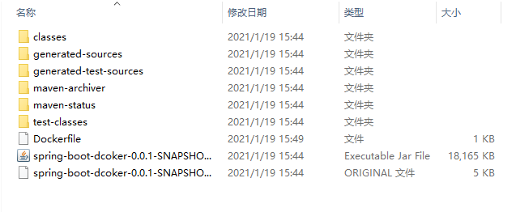
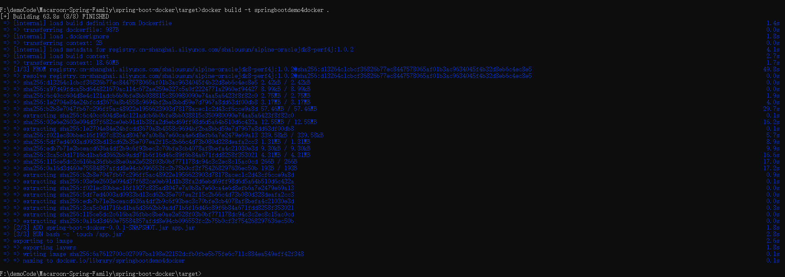
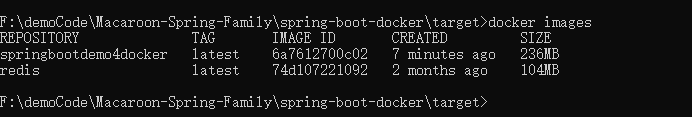
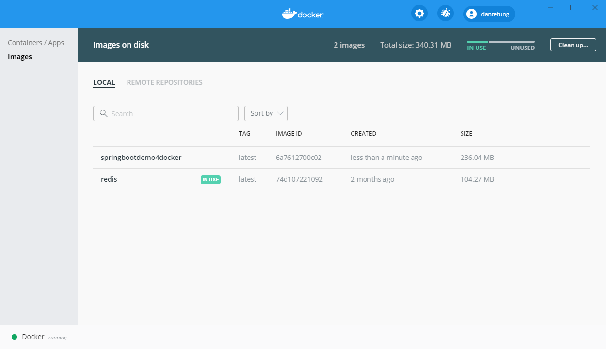
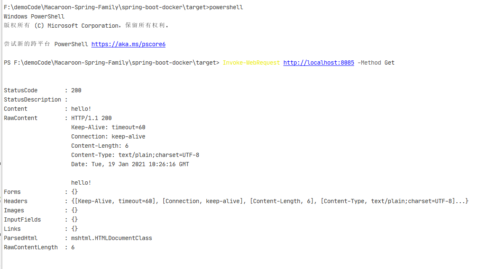

# 工程简介

## 0、环境、软件准备

- windows平台
- Docker Destop 最新版
- Maven：version 3.3.9
- Java： version 1.8.0_91
- docker-maven-plugin：1.0.0

## 1、手工作业

### 第一步: maven打包
```
mvn package -Dmaven.test.skip=true
```
> NOTE: 不执行测试用例，也不编译测试用例类。
``` 
mvn package -DskipTests=true
```
> NOTE: 不执行测试用例，但编译测试用例类生成相应的class文件至target/test-classes下。

### 第二步: 将Dockerfile与jar包放在同一目录下




### 第三步: 制作镜像
> NOTE: 前提是你本机已经安装了Docker
``` 
docker build -t springbootdemo4docker .
```


制作完成后通过docker images命令查看我们制作的镜像
``` 
docker images
```

或者Docker Desktop也可以查看


### 第四步: 测试
启动容器
``` 
docker run -d -p 8080:8085 springbootdemo4docker
```
> NOTE:
> 
> -d参数是让容器后台运行
> 
>-p 是做端口映射，此时将服务器中的8080端口映射到容器中的8085(项目中端口配置的是8085)端口

访问站点:
``` 
Invoke-WebRequest http://localhost:8085 -Method Get
```



## 2、MAVEN插件
### docker-maven-plugin 介绍
> 在我们持续集成过程中，项目工程一般使用 Maven 编译打包，然后生成镜像，通过镜像上线，能够大大提供上线效率，同时能够快速动态扩容，快速回滚，着实很方便。docker-maven-plugin 插件就是为了帮助我们在Maven工程中，通过简单的配置，自动生成镜像并推送到仓库中。

### 两种方式
1. 第一种是将构建信息指定到 POM 中。
2. 使用已存在的 Dockerfile 构建。

方式一:
``` 
<build>
    <plugins>
        <plugin>
            <groupId>com.spotify</groupId>
            <artifactId>docker-maven-plugin</artifactId>
            <version>1.0.0</version>
            <configuration>
                <imageName>mavendemo</imageName>
                <baseImage>java</baseImage>
                <maintainer>docker_maven docker_maven@email.com</maintainer>
                <workdir>/ROOT</workdir>
                <cmd>["java", "-version"]</cmd>
                <entryPoint>["java", "-jar", "${project.build.finalName}.jar"]</entryPoint>
                <!-- 这里是复制 jar 包到 docker 容器指定目录配置 -->
                <resources>
                    <resource>
                        <targetPath>/ROOT</targetPath>
                        <directory>${project.build.directory}</directory>
                        <include>${project.build.finalName}.jar</include>
                    </resource>
                </resources>
            </configuration>
        </plugin>
    </plugins>
</build>
```
方式二:
``` 
<build>
    <plugins>
         <plugin>
            <groupId>com.spotify</groupId>
            <artifactId>docker-maven-plugin</artifactId>
            <version>1.0.0</version>
            <configuration>
                <imageName>mavendemo</imageName>
                <dockerDirectory>${basedir}/docker</dockerDirectory> <!-- 指定 Dockerfile 路径-->
                <!-- 这里是复制 jar 包到 docker 容器指定目录配置，也可以写到 Docokerfile 中 -->
                <resources>
                    <resource>
                        <targetPath>/ROOT</targetPath>
                        <directory>${project.build.directory}</directory>
                        <include>${project.build.finalName}.jar</include>
                    </resource>
                </resources>
            </configuration>
        </plugin>   
    </plugins>
</build>
```

**制作镜像**
``` 
mvn clean package docker:build
```


## 3、IDEA插件


# 延伸阅读
- [新版Docker 2020](https://www.bilibili.com/video/BV187411o7vR?p=27)
> 注: 课件B站评论区的同鞋有提供，本工程已经下载至doc/docker目录下.
- 《Docker实战》
- [Spring Boot with Docker](https://spring.io/guides/gs/spring-boot-docker/)

# 补充说明
``` 
#/dev/urandom则是一个非阻塞的发生器
java -Djava.security.egd=file:/dev/./urandom -jar /aap.jar
```
**关于执行命令的说法**

dev/random的一个副本是/dev/urandom（”unlocked”，非阻塞的随机数发生器），它会重复使用熵池中的数据以产生伪随机数据。这表示对/dev/urandom的读取操作不会产生阻塞，但其输出的熵可能小于/dev/random的。它可以作为生成较低强度密码的伪随机数生成器，不建议用于生成高强度长期密码。

另外wiki里也提到了为什么linux内核里的随机数生成器采用SHA1散列算法而非加密算法，是为了避开法律风险(密码出口限制)。

回到tomcat文档里的建议，采用非阻塞的熵源(entropy source)，通过java系统属性来设置：

-Djava.security.egd=file:/dev/./urandom

这个系统属性egd表示熵收集守护进程(entropy gathering daemon)，但这里值为何要在dev和random之间加一个点呢？是因为一个jdk的bug，在这个bug的连接里有人反馈及时对 securerandom.source 设置为/dev/urandom它也仍然使用的/dev/random，有人提供了变通的解决方法，其中一个变通的做法是对securerandom.source设置为/dev/./urandom才行。也有人评论说这个不是bug，是有意为之。