# 工程简介

## 0、环境、软件准备

- windows平台
- Docker Destop 最新版
- Maven：version 3.3.9
- Java： version 1.8.0_91
- docker-maven-plugin：1.0.0

## 1、手工作业

### 第一步: maven打包
```
mvn package -Dmaven.test.skip=true
```
> NOTE: 不执行测试用例，也不编译测试用例类。
``` 
mvn package -DskipTests=true
```
> NOTE: 不执行测试用例，但编译测试用例类生成相应的class文件至target/test-classes下。

### 第二步: 将Dockerfile与jar包放在同一目录下


### 第三步: 制作镜像
> NOTE: 前提是你本机已经安装了Docker
``` 
docker build -t springbootdemo4docker .
```


制作完成后通过docker images命令查看我们制作的镜像
``` 
docker images
```

或者Docker Desktop也可以查看


### 第四步: 测试
启动容器
``` 
docker run -d -p 8080:8085 springbootdemo4docker
```
> NOTE:
> 
> -d参数是让容器后台运行
> 
>-p 是做端口映射，此时将服务器中的8080端口映射到容器中的8085(项目中端口配置的是8085)端口

访问站点:
``` 
Invoke-WebRequest http://localhost:8085 -Method Get
```


## 2、MAVEN插件
### 插件选型
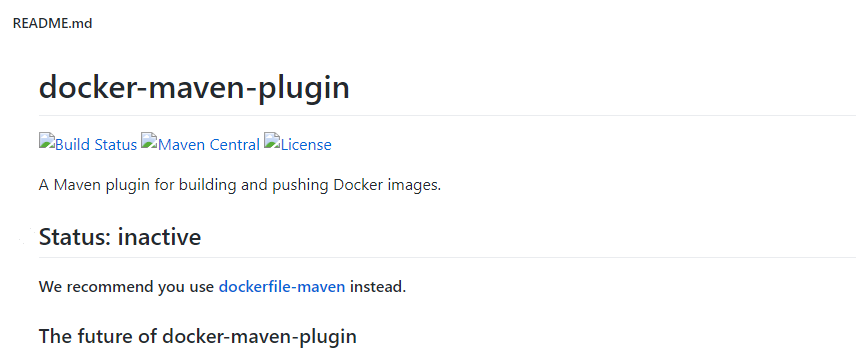

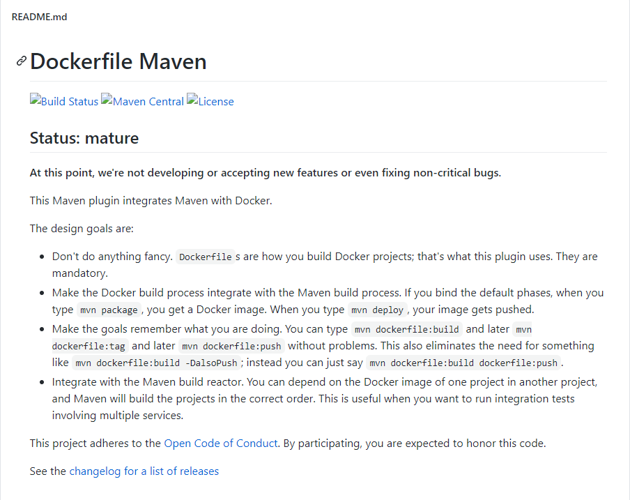

> NOTE: 
>
>Dockerfile Maven
>
>Build Status Maven Central License
>
>Status: mature (成熟的)
>
>At this point, we're not developing or accepting new features or even fixing non-critical bugs.
>
>This Maven plugin integrates Maven with Docker.

TODO: 待完善...


## 3、IDEA插件
开启docker服务端:

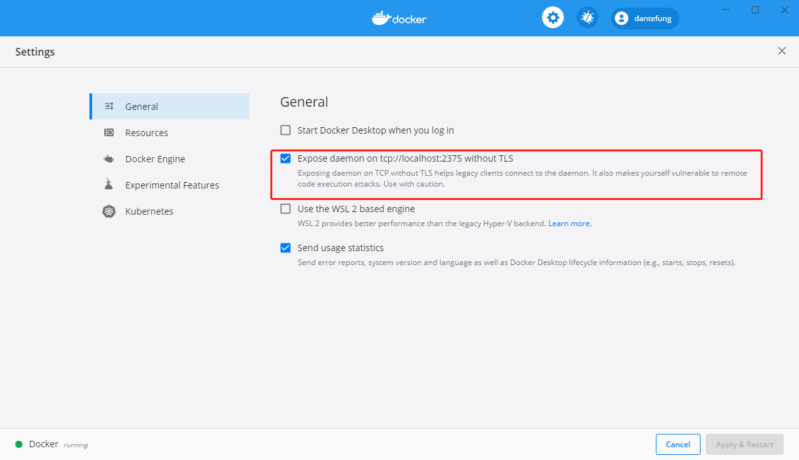

IDEA客户端:

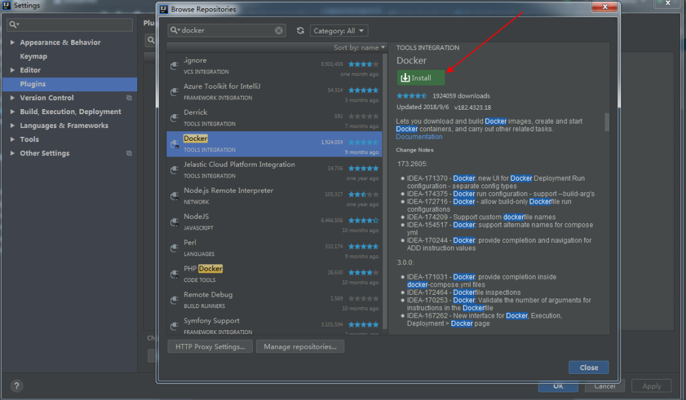

### 连接远程docker:

1. 编辑配置

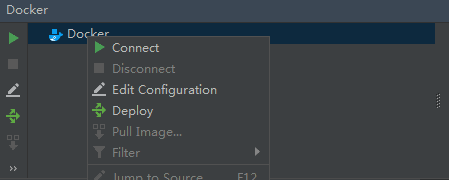

2. 填写远程地址

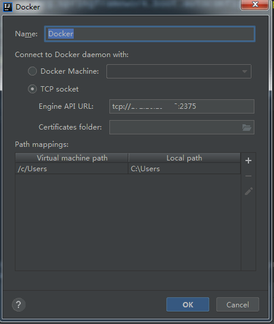

3. 连接成功，会列出远程 docker 容器和镜像

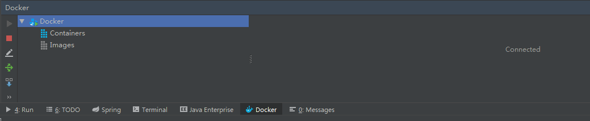 

### 配置POM
```
            <!-- 将target下的jar包拷贝到src/main/docker目录下-->
            <plugin>
                <artifactId>maven-antrun-plugin</artifactId>
                <executions>
                    <execution>
                        <phase>package</phase>
                        <configuration>
                            <tasks>
                                <copy todir="src/main/docker" file="target/${project.artifactId}-${project.version}.${project.packaging}"></copy>
                            </tasks>
                        </configuration>
                        <goals>
                            <goal>run</goal>
                        </goals>
                    </execution>
                </executions>
            </plugin>
```
### Run/Debug Configuration 配置dockerfile

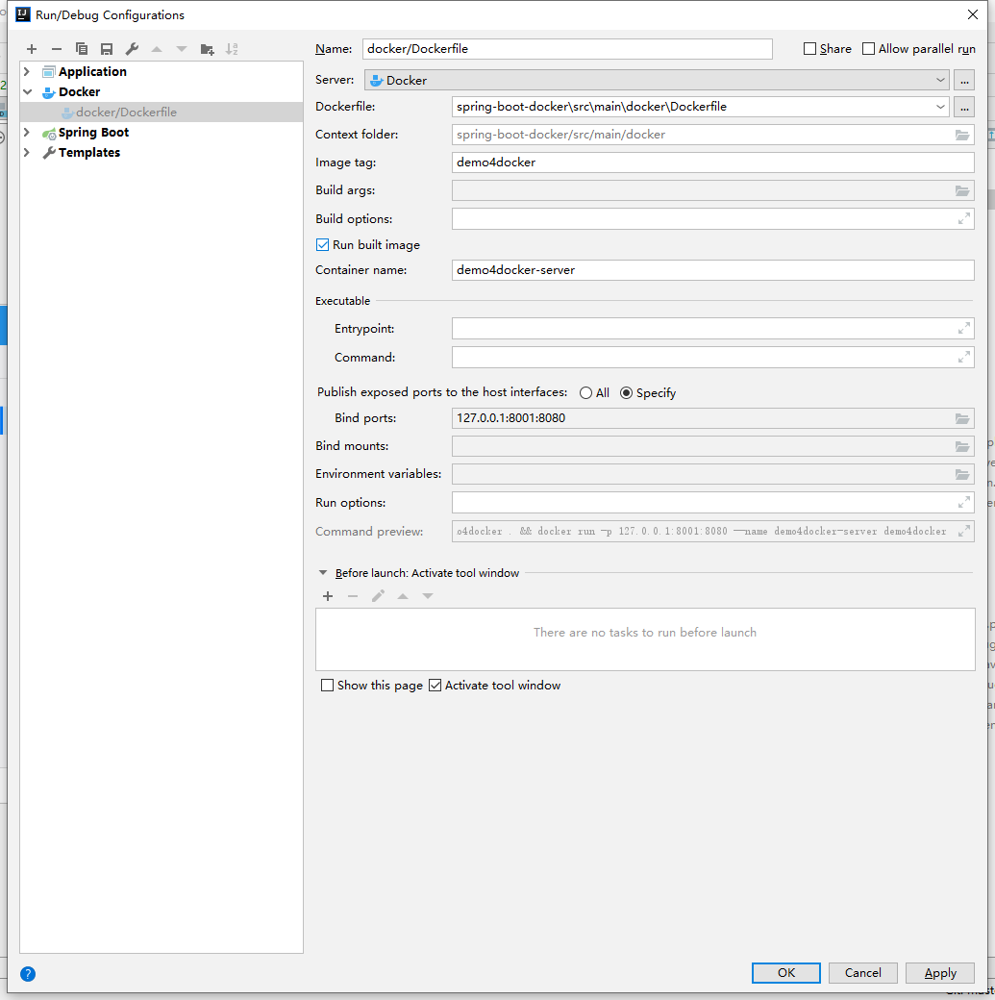

### 打包并制作镜像

执行打包命令

``` 
mvn package -Dmaven.test.skip=true
```
或

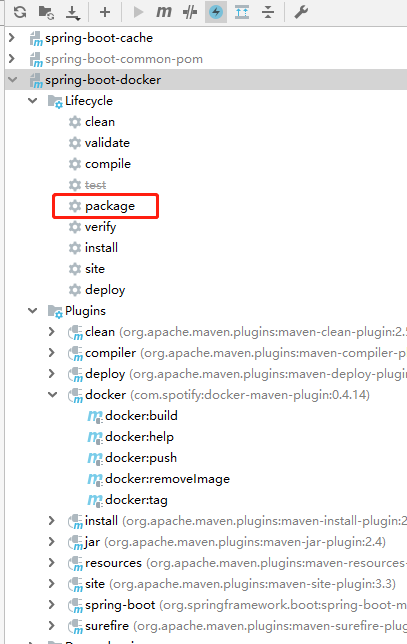


点击构建镜像按钮

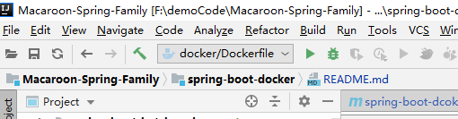

可见已经构建镜像成功并运行

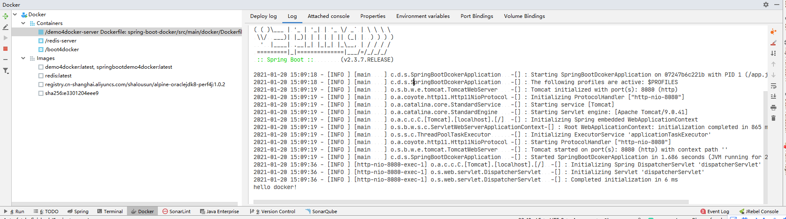

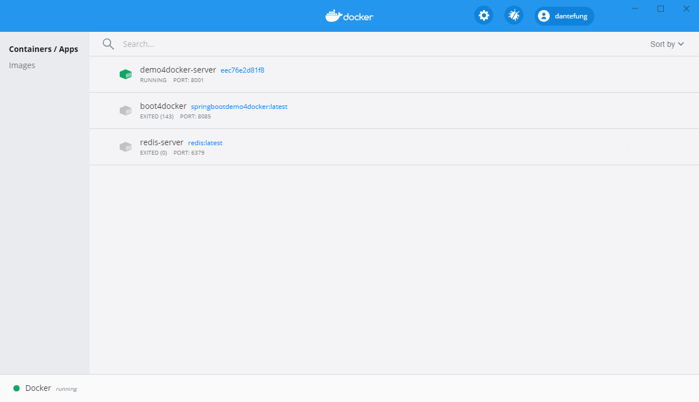

## 4、Jenkins


# 延伸阅读
- [新版Docker 2020](https://www.bilibili.com/video/BV187411o7vR?p=27)
> 注: 课件B站评论区的同鞋有提供，本工程已经下载至doc/docker目录下.
- 《Docker实战》
- [Spring Boot with Docker](https://spring.io/guides/gs/spring-boot-docker/)
- [Docker遇到IDEA](https://mp.weixin.qq.com/s/Xb3DptyTGH-pbiR01W47sw)
- [docker-maven-plugin](https://github.com/spotify/docker-maven-plugin)
- [Dockerfile Maven](https://github.com/spotify/dockerfile-maven)

# 补充说明
``` 
#/dev/urandom则是一个非阻塞的发生器
java -Djava.security.egd=file:/dev/./urandom -jar /aap.jar
```
**关于执行命令的说法**
目的: 为了缩短 Tomcat 的启动时间，添加java.security.egd的系统属性指向/dev/urandom作为 ENTRYPOINT。

dev/random的一个副本是/dev/urandom（”unlocked”，非阻塞的随机数发生器），它会重复使用熵池中的数据以产生伪随机数据。这表示对/dev/urandom的读取操作不会产生阻塞，但其输出的熵可能小于/dev/random的。它可以作为生成较低强度密码的伪随机数生成器，不建议用于生成高强度长期密码。

另外wiki里也提到了为什么linux内核里的随机数生成器采用SHA1散列算法而非加密算法，是为了避开法律风险(密码出口限制)。

回到tomcat文档里的建议，采用非阻塞的熵源(entropy source)，通过java系统属性来设置：

-Djava.security.egd=file:/dev/./urandom

这个系统属性egd表示熵收集守护进程(entropy gathering daemon)，但这里值为何要在dev和random之间加一个点呢？是因为一个jdk的bug，在这个bug的连接里有人反馈及时对 securerandom.source 设置为/dev/urandom它也仍然使用的/dev/random，有人提供了变通的解决方法，其中一个变通的做法是对securerandom.source设置为/dev/./urandom才行。也有人评论说这个不是bug，是有意为之。