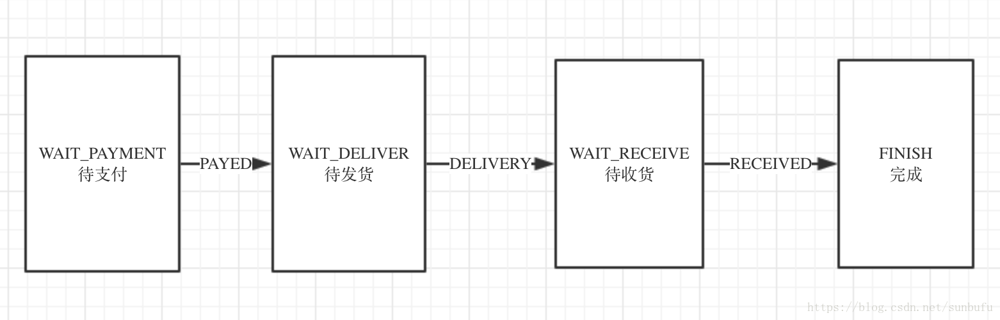

## 一、状态机
有限状态机是一种用来进行对象行为建模的工具，其作用主要是描述对象在它的生命周期内所经历的状态序列，以及如何响应来自外界的各种事件。在电商场景（订单、物流、售后）、社交（IM消息投递）、分布式集群管理（分布式计算平台任务编排）等场景都有大规模的使用。

**状态机的要素：**

状态机可归纳为4个要素，现态、条件、动作、次态。“现态”和“条件”是因，“动作”和“次态”是果。
 
1 现态：指当前所处的状态

2 条件：又称“事件”，当一个条件被满足，将会触发一个动作，或者执行一次状态的迁移

3 动作：条件满足后执行的动作。动作执行完毕后，可以迁移到新的状态，也可以仍旧保持原状态。动作不是必须的，当条件满足后，也可以不执行任何动作，直接迁移到新的状态。

4 次态：条件满足后要迁往的新状态。“次态”是相对于“现态”而言的，“次态”一旦被激活，就转换成“现态”。


**状态机动作类型：**

进入动作：在进入状态时进行

退出动作：在退出状态时进行

输入动作：依赖于当前状态和输入条件进行

转移动作：在进行特定转移时进行

## spring statemachine



``` 
/**
 * 配置状态
 * @param states
 * @throws Exception
 */
@Override
public void configure(StateMachineStateConfigurer<OrderStatus, OrderStatusChangeEvent> states) throws Exception {
    states
            .withStates()
            .initial(OrderStatus.WAIT_PAYMENT)
            .states(EnumSet.allOf(OrderStatus.class));
}


/**
 * 配置状态转换事件关系
 * @param transitions
 * @throws Exception
 */
@Override
public void configure(StateMachineTransitionConfigurer<OrderStatus, OrderStatusChangeEvent> transitions)
        throws Exception {
    transitions.withExternal().source(OrderStatus.WAIT_PAYMENT).target(OrderStatus.WAIT_DELIVER)
            .event(OrderStatusChangeEvent.PAYED).and().withExternal().source(OrderStatus.WAIT_DELIVER)
            .target(OrderStatus.WAIT_RECEIVE).event(OrderStatusChangeEvent.DELIVERY).and().withExternal()
            .source(OrderStatus.WAIT_RECEIVE).target(OrderStatus.FINISH).event(OrderStatusChangeEvent.RECEIVED);
}
```


